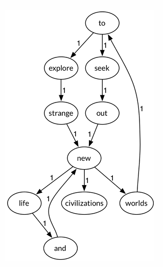

<<<<<<< HEAD
1. 总体需求：开发一个程序，实现从文本文件中读取数据并根据要求生成图结构，输出该图结构，并在其上进行一系列计算操作，实时展示各操作的结果。开发的程序可以是命令行方式运行，也可以用图形化用户界面GUI的方式运行。无论何种方式，均应覆盖后续所有功能需求。aaaaaa
=======
1. 总体需求：开发一个程序，实现从文本文件中读取数据并根据要求生成图结构，输出该图结构，并在其上进行一系列计算操作，实时展示各操作的结果。开发的程序可以是命令行方式运行，也可以用图形化用户界面GUI的方式运行。无论何种方式，均应覆盖后续所有功能需求。
>>>>>>> Lab3b

2. 输入：文本文件：
     2.1 输入一个文本文件，其中包含用英文书写的文本数据；
     2.2 文本分为多行，你的程序应默认将换行/回车符当作空格；
     2.3 文本中的任何标点符号，也应当作空格处理；
     2.4 文本中的非字母(A-Z, a-z)字符应被忽略。
     2.5 例子：To @ explore strange new worlds,
      To seek out new life and new civilizations?
     处理后为：to explore strange new worlds to seek out new life and new civilizations

3. 功能需求1：读入文本并生成有向图

     程序首先让用户选择或输入文本文件的位置和文件名。也可以参数的形式，在启动程序时提供文件路径和文件名。

     程序读入文本数据，进行分析，将其转化为有向图：

     - 有向图的节点为文本中包含的某个单词（不区分大小写）

     - 两个节点A,B之间存在一条边A→B，意味着在文本中至少有一处位置 A 和 B 相邻出现（即A和B之间有且仅有1或多个空格）。

     - A→B的权重w=文本中A和B相邻出现的次数，w>=1。

     - 例子：文本：To explore strange new worlds, To seek out new life and new civilizations

<<<<<<< HEAD
=======
       ​		图片：

>>>>>>> Lab3b
       

4. 功能需求2：展示生成的有向图

     将生成的有向图以图形文件形式保存到磁盘，可以调用外部绘图库或绘图工具API自动生成有向图，但不能采用手工方式绘图。

5. 功能需求3：查询桥接词（bridge words）

     - 在生成有向图之后，用户输入任意两个英文单词word1、word2，程序从图中查询它们的“桥接词”。
     - word1、word2的桥接词word3：图中存在两条边word1→word3, word3→word2。
     - 输入的word1或word2如果不在图中出现，则输出“No word1 or word2 in the graph!”
     - 如果不存在桥接词，则输出“No bridge words from word1 to word2!”
     - 如果存在一个或多个桥接词，则输出“The bridge words from word1 to word2 are: xxx, xxx, and xxx.”

6. 功能需求4：根据bridge word生成新文本

     - 用户输入一行新文本，程序根据之前输入文件生成的图，计算该新文本中两两相邻的单词的 bridge word，将bridge word插入新文本的两个单词之间，输出到屏幕上展示。
       - 如果两个单词无bridge word，则保持不变，不插入任何单词；
       - 如果两个单词之间存在多个bridge words，则随机从中选择一个插入进去形成新文本。
     - 例如用户输入：Seek to explore new and  exciting synergies ，则输出结果为：Seek to explore strange new life and exciting synergies

7. 功能需求5：计算两个单词之间的最短路径

     - 用户输入两个单词，程序计算它们之间在图中的最短路径（路径上所有边权值之和最小），以某种突出的方式将路径标注在原图并展示在屏幕上，同时展示路径的长度（所有边权值之和）。例如：输入to和and，则其最短路径为to→explore→strange→new→life→and 
     - 计算出所有的最短路径，并以不同的突出显示方式展示出来。例如to和and之间还有另一条路径： to→seek→out→new→life→and。 
     - 如果输入的两个单词“不可达”，则提示。
     - 如果用户只输入一个单词，则程序计算出该单词到图中其他任一单词的最短路径，并逐项展示出来。

8. 功能需求6：随机游走

     - 进入该功能时，程序随机的从图中选择一个节点，以此为起点沿出边进行随机遍历，记录经过的所有节点和边，直到出现第一条重复的边为止，或者进入的某个节点不存在出边为止。在遍历过程中，用户也可随时停止遍历。
     - 将遍历的节点输出为文本，并以文件形式写入磁盘。
     - 例如：
          - to seek out new life and new worlds to explore strange new civilizations
          - to explore strange new worlds to explore

9. 代码风格：在一个.java文件里，其中至少包含以下函数：

     - main(…)：主程序入口，接收用户输入文件，生成图，并允许用户选择后续各项功能；
     - void showDirectedGraph(type G, …)：展示有向图
     - String queryBridgeWords(String word1, String word2)：查询桥接词
     - String generateNewText(String inputText)：根据bridge word生成新文本
     - String calcShortestPath(String word1, String word2)：计算两个单词之间的最短路径
     - String randomWalk()：随机游走

10. 其它要求：

     - 除了main()之外，上述其他函数应尽可能保持与用户输入/系统输出的独立性（所有输入输出均应在main函数中完成）；

     - 不能改变函数的specification（参数列表/类型、返回值类型、函数名）；
       - 例外1：函数void showDirectedGraph(type G,…)的输入参数G的类型type，由开发者自行定义；可根据需要增加其他参数。
       - 例外2：函数main(String[] args)的输入参数个数与具体含义由开发者自定义。
     - 必要时可增加其他辅助函数，但须在实验报告中列清楚各函数的作用；
     - 避免使用任何第三方Java外部算法库完成上述功能（除了在项目中必须的）。

